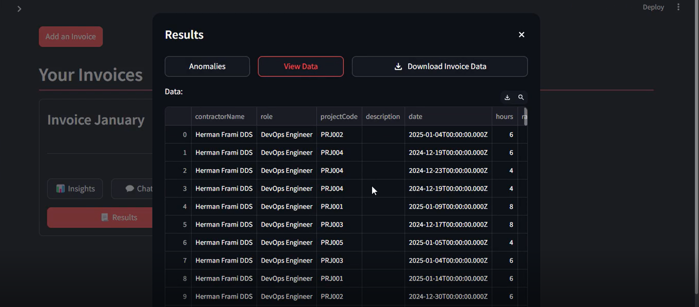
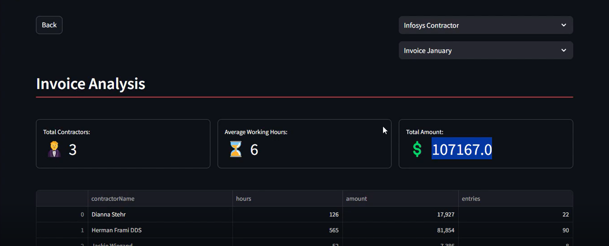
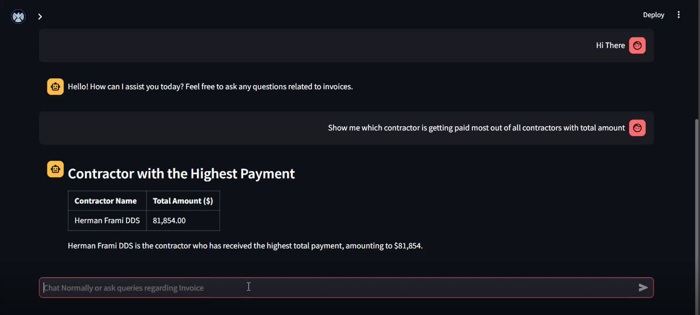

# Local Setup Steps

### 1. Git clone

### 2. solve the error using stackoverflow

### 3. git clone

### <Switch to a specific branch by git checkout <branch> >

### 4. python -m venv .venv

### 5. get keys from repo owner and save in .streamlit/secrets.toml

### 5. pip install -r requirements.txt

### 6. .venv\Scripts\Activate

### 7. streamlit run app.py

# App Previews

---

## Extracted Invoice data from PDF

---

## Invoice Analysis

---

## Analyse using chat feature

